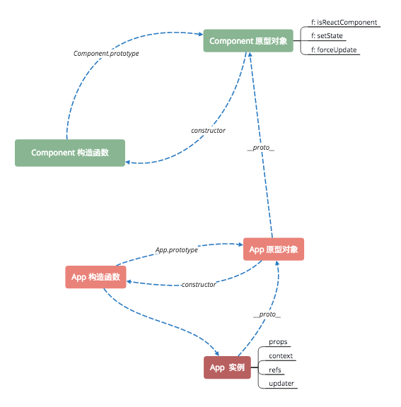
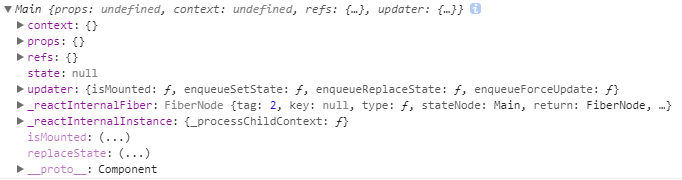

## startinig fresh

>预备知识
>
> [Symbol](http://es6.ruanyifeng.com/#docs/symbol)
>
> [viod 0 干了什么？](https://developer.mozilla.org/zh-CN/docs/Web/JavaScript/Reference/Operators/void)

### node_modules 中的 react

开发环境中引入的是 react.development.js，整个文件最终 module.exports 一个如下的对象。

```javascript
var React = {
  Children: {
    map: mapChildren,
    forEach: forEachChildren,
    count: countChildren,
    toArray: toArray,
    only: onlyChild
  },

  createRef: createRef,
  Component: Component,
  PureComponent: PureComponent,

  createContext: createContext,
  forwardRef: forwardRef,

  Fragment: REACT_FRAGMENT_TYPE,
  StrictMode: REACT_STRICT_MODE_TYPE,
  unstable_AsyncMode: REACT_ASYNC_MODE_TYPE,
  unstable_Profiler: REACT_PROFILER_TYPE,

  createElement: createElementWithValidation,
  cloneElement: cloneElementWithValidation,
  createFactory: createFactoryWithValidation,
  isValidElement: isValidElement,

  version: ReactVersion,

  __SECRET_INTERNALS_DO_NOT_USE_OR_YOU_WILL_BE_FIRED: {
    ReactCurrentOwner: ReactCurrentOwner,
    // Used by renderers to avoid bundling object-assign twice in UMD bundles:
    assign: _assign
  }
};

module.exports = react;
```


### Component

```javascript
function Component(props, context, updater) {
  this.props = props;
  this.context = context;
  // If a component has string refs, we will assign a different object later.
  this.refs = emptyObject;
  // We initialize the default updater but the real one gets injected by the
  // renderer.
  this.updater = updater || ReactNoopUpdateQueue;
}

Component.prototype.isReactComponent = {};

Component.prototype.setState = function(partialState, callback) {
  invariant(
    typeof partialState === 'object' ||
      typeof partialState === 'function' ||
      partialState == null,
    'setState(...): takes an object of state variables to update or a ' +
      'function which returns an object of state variables.',
  );
  this.updater.enqueueSetState(this, partialState, callback, 'setState');
};

Component.prototype.forceUpdate = function(callback) {
  this.updater.enqueueForceUpdate(this, callback, 'forceUpdate');
};

```

这里 emptyObject 是用 Object.freeze 冻结的一个空对象

```javascript
const emptyObject = {};
if (__DEV__) {
  Object.freeze(emptyObject);
}
```

Component 是个构造函数。原型上挂了 setState，forceUpdate等方法。继承于 Component (`class App extends Component{ ... }`) 的新类，实例上将挂上 props, context, refs, updater 等。





#### Component.prototype

 - Component.prototype.setState
 - Component.prototype.forceUpdate


invariant 对传入的 partialState 进行判断，如果 partialState 不是 Object，Function 或 null 中任一类型，就会 threw Error，内容就是后续的一串 `setState(...): ...`。

在组件还未 mounted 之前调用这两个方法，则打出 warning


### createRef()

```javascript
// an immutable object with a single mutable value
function createRef() {
  var refObject = {
    current: null
  };
  {
    Object.seal(refObject);
  }
  return refObject;
}
```

注释已经讲清楚了，这个方法返回一个 Object.seal() 处理过的对象。关于 [Object.seal()](https://developer.mozilla.org/zh-CN/docs/Web/JavaScript/Reference/Global_Objects/Object/seal)。

### PureComponent

```javascript
function ComponentDummy() {}
ComponentDummy.prototype = Component.prototype;

/**
 * Convenience component with default shallow equality check for sCU.
 */
function PureComponent(props, context, updater) {
  this.props = props;
  this.context = context;
  this.refs = emptyObject;
  this.updater = updater || ReactNoopUpdateQueue;
}

var pureComponentPrototype = PureComponent.prototype = new ComponentDummy();
pureComponentPrototype.constructor = PureComponent;
// Avoid an extra prototype jump for these methods.
_assign(pureComponentPrototype, Component.prototype);
pureComponentPrototype.isPureReactComponent = true;
```

PureComponent 不是简单直接继承自 Component（不然就没有 ComponentDummy 啥事了）；ComponentDummy 作用是把 Component 的原型对象加上一个修饰 `isPureReactComponent = true`，这样所有 PureComponent 共享父类的原型对象这个属性。

### createContext

```javascript
function createContext(defaultValue, calculateChangedBits) {
  if (calculateChangedBits === undefined) {
    calculateChangedBits = null;
  } else {
    {
      !(calculateChangedBits === null || typeof calculateChangedBits === 'function') ? warning(false, 'createContext: Expected the optional second argument to be a ' + 'function. Instead received: %s', calculateChangedBits) : void 0;
    }
  }

  var context = {
    $$typeof: REACT_CONTEXT_TYPE,
    _calculateChangedBits: calculateChangedBits,
    _defaultValue: defaultValue,
    _currentValue: defaultValue,
    // As a workaround to support multiple concurrent renderers, we categorize
    // some renderers as primary and others as secondary. We only expect
    // there to be two concurrent renderers at most: React Native (primary) and
    // Fabric (secondary); React DOM (primary) and React ART (secondary).
    // Secondary renderers store their context values on separate fields.
    _currentValue2: defaultValue,
    _changedBits: 0,
    _changedBits2: 0,
    // These are circular
    Provider: null,
    Consumer: null
  };

  context.Provider = {
    $$typeof: REACT_PROVIDER_TYPE,
    _context: context
  };
  context.Consumer = context;

  {
    context._currentRenderer = null;
    context._currentRenderer2 = null;
  }

  return context;
}
```

创建上下文？首先对传入的参数校验，第二个参数要么不传（undefined）要么为 function。现在具体看看返回的对象

```
$$typeof              // Symbol全局注册表中的标识
_calculateChangedBits // ?? function | undefined

_defaultValue         // --
_currentValue         // ---- ?? defaultValue
_currentValue2        // --

_changedBits          // --
_changedBits2         // ---- 0

Provider
  |-- $$typeof        // Symbol全局注册表中的标识
  |-- _context        // context 自身的引用

Consumer              // context 自身的引用

_currentRenderer      // null React Native (primary)
_currentRenderer      // null Fabric (secondary)
```

### forwardRef

```javascript
function forwardRef(render) {
  {
    !(typeof render === 'function') ? warning(false, 'forwardRef requires a render function but was given %s.', render === null ? 'null' : typeof render) : void 0;

    if (render != null) {
      !(render.defaultProps == null && render.propTypes == null) ? warning(false, 'forwardRef render functions do not support propTypes or defaultProps. ' + 'Did you accidentally pass a React component?') : void 0;
    }
  }

  return {
    $$typeof: REACT_FORWARD_REF_TYPE,
    render: render
  };
}
```

forWardRef 大部分工作是在对参数校验。参数必须是 function ，并且没有 defaultProps 和 propTypes 这两个属性（程序会提醒你，可能传入了一个 React 组件）。

最终返回的对象中，加上了 $$typeof 标识，为 `REACT_FORWARD_REF_TYPE` 。

### ReactCurrentOwner

标识当前处理的 ReactComponent 对象。

### Fragment StrictMode unstable_AsyncMode unstable_Profiler

这些值都是全局 Symbol 注册表里面的 Symbol 对象。具体标识什么，用到再探究吧。

###  createElement

```javascript
function createElement(type, config, children) {
	//...
}
```

config 参数校验：`hasValidRef` -> `hasValidKey` 

config 处理过后可能的形态：

```
config
  |-- 'ref'     // undefined or config.ref
  |-- 'key'     // undefined or config.key
  |-- __self    // null or config.__self
  |-- __source  // null or config.__source
```

接下来 `for..in` 遍历 config，把所有可枚举属性（除去 RESERVED_PROPS中已有键值）放入 props 对象。

```javascript
for (propName in config) {
	if (hasOwnProperty.call(config, propName) && !RESERVED_PROPS.hasOwnProperty(propName)) {
		props[propName] = config[propName];
	}
}
```

下一步根据 children 的长度，把单个 children 或数组 children 赋给 props.children。

处理缺省 props，在 type.defaultProps 中查询，添加到 props 对象。

warning 处理：props.$$typeof undefined 或不为 REACT_ELEMENT_TYPE（我们认为这样到 props 不是一个 REACT_ELEMENT_TYPE 标识的对象，用在这里不合法）

最后重头戏，调用 ReactElement 构造函数。

```javascript
return ReactElement(type, key, ref, self, source, ReactCurrentOwner.current, props);
```

传给 ReactElement 的 owner 参数是 ReactCurrentOwner.current，当前 React 所在容器 ？？

JSX其实是 React.createElement 的语法糖，参阅 [React without JSX](https://doc.react-china.org/docs/react-without-jsx.html)

### cloneElement

```javascript
function cloneElement(element, config, children) {
	// ...
}
```

基于 Element ，克隆并返回一个新的React元素(React Element)。生成元素的 props 是由 element.props + element.type.defaultProps/config 的浅合并。

```javascript
// Owner will be preserved, unless ref is overridden
var owner = element._owner;

if (config != null) {
	if (hasValidRef(config)) {
		// Silently steal the ref from the parent.
		ref = config.ref;
		owner = ReactCurrentOwner.current;
	}
	// ...
}
```

官网原话：如果你通过 ref 获取到子级组件时，不会一不小心从祖先组件里窃取了它。你将获得与你新元素相同的 ref 。

