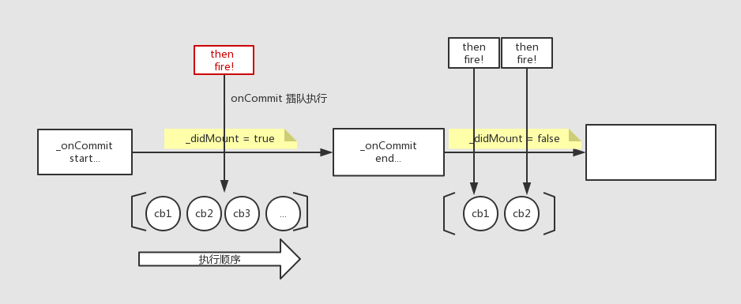

## 常量

```javascript
/**
 * HTML nodeType values that represent the type of the node
 */

var ELEMENT_NODE = 1;
var TEXT_NODE = 3;
var COMMENT_NODE = 8;
var DOCUMENT_NODE = 9;
var DOCUMENT_FRAGMENT_NODE = 11;

var ROOT_ATTRIBUTE_NAME = 'data-reactroot';

```

## 基本类

### ReactRoot


每个 ReactRoot 都有一个自有属性 _internalRoot ，是一个 FiberNode 的实例。


#### render

```javascript
ReactRoot.prototype.render = function (children, callback) {
  var root = this._internalRoot;
  var work = new ReactWork();
  callback = callback === undefined ? null : callback;
  {
    warnOnInvalidCallback(callback, 'render');
  }
  if (callback !== null) {
    work.then(callback);
  }
  updateContainer(children, root, null, work._onCommit);
  return work;
};
```

ReactRoot 的实例每次调用 render，都会注册一个 ReactWork 对象。即使是同一个实例，不同的 render 返回的 ReactWork 实例不同。也就是说，每一次 render，都由一个独一无二的 ReactWork 维护。 

`new ReactWork()`的实例，_didCommit 的初始值为false，所以`work.then(callback)` 会把 callback 放入对应 ReactWork 的回调函数列表中。


### ReactWork


每一个 ReactWork 上，都有三个 **自有属性** `_callbacks` `_didCommit` `_onCommit`。

```javascript
this._callbacks = null;
this._didCommit = false;
// TODO: Avoid need to bind by replacing callbacks in the update queue with
// list of Work objects.
this._onCommit = this._onCommit.bind(this);
```

实例上自有属性 _onCommit 方法是绑定了当前实例对象的原型链 _onCommit 方法。看注释，估计未来这种绑定方法应会被替换为更合理的方法。

接下来看原型对象上的方法。

```javascript
ReactWork.prototype.then = function (onCommitonCommit) {
  if (this._didCommit) {
    onCommit();
    return;
  }
  var callbacks = this._callbacks;
  if (callbacks === null) {
    callbacks = this._callbacks = [];
  }
  callbacks.push(onCommit);
};
```

then 接收一个 onCommit 动作（函数），如果实例 _didCommit 为 true ，那么直接执行这个动作。否则把它压入对象的 _callbacks 数组。

```javascript
ReactWork.prototype._onCommit = function () {
  if (this._didCommit) {
    return;
  }
  this._didCommit = true;
  var callbacks = this._callbacks;
  if (callbacks === null) {
    return;
  }
  // TODO: Error handling.
  for (var i = 0; i < callbacks.length; i++) {
    var _callback2 = callbacks[i];
    !(typeof _callback2 === 'function') ? invariant(false, 'Invalid argument passed as callback. Expected a function. Instead received: %s', _callback2) : void 0;
    _callback2();
  }
};
```

如果实例的拥有自有方法 _onCommit ，所以实例 _onCommit 方法的触发，站在实例对象的角度。如果 _didCommit 为 true ，_onCommit 什么也不做；否则将 _didCommit 标记为 true ，表明这个对象正在进行一次 commit ，然后一个个执行 _callbacks 数组中堆积的要做的事情。因为 _callbacks里面的元素是一个个 push 进去的，所以先 push 进去的会先执行。




## 方法

### getReactRootElementInContainer

```javascript
function getReactRootElementInContainer(container) {
  if (!container) {
    return null;
  }

  if (container.nodeType === DOCUMENT_NODE) {
    return container.documentElement;
  } else {
    return container.firstChild;
  }
}
```


### container （DOM Element）的挂载点

在 container 没有挂载点的时候，登记它的挂载点

```javascript
// Initial mount
root = container._reactRootContainer = legacyCreateRootFromDOMContainer(container, forceHydrate);
```

首先确定是否强制聚合。即 forceHydrate 。render 的时候，forceHydrate 的值为 false ，所以由 shouldHydrateDueToLegacyHeuristic(container) 的结果决定。

getReactRootElementInContainer 获取 container 的 rootElement ，当且仅当 rootElement 是 DOM 元素节点并且有 ROOT_ATTRIBUTE_NAME 标识（这里的值为 `'data-reactroot'`），shouldHydrate 结果为 true。

shouldHydrate false时，清空 container 中所有符合 rootElement 的节点。

返回的挂载点是一个 ReactRoot 实例：

```javascript
  // Legacy roots are not async by default.
  var isAsync = false;
	return new ReactRoot(container, isAsync, shouldHydrate);
```

### unbatchedUpdates

全局初始化变量

```javascript
var isBatchingUpdates = false;
var isUnbatchingUpdates = false;
```

这两个变量是当前 BatchUpdates 信号灯。标识当前是否正在处理：1. 批量更新；2. 非批量更新。


```javascript
function unbatchedUpdates(fn, a) {
  if (isBatchingUpdates && !isUnbatchingUpdates) {
    isUnbatchingUpdates = true;
    try {
      return fn(a);
    } finally {
      isUnbatchingUpdates = false;
    }
  }
  return fn(a);
}
```

当且仅当 isBatchingUpdates 为 true ，isUnbatchingUpdates 为 false，unbatchedUpdates 认为当前可能要 “排队” 等非批量更新。此时把 isUnbatchingUpdates 标记为true。执行更新 `fn(a)`，无论成功或失败，最终再把 isUnbatchingUpdates 标记为 false，允许下一次非批量更新直接更新。

### updateContainer

```javascript
function updateContainer(element, container, parentComponent, callback) {
  var current = container.current;
  var currentTime = recalculateCurrentTime();
  var expirationTime = computeExpirationForFiber(currentTime, current);
  return updateContainerAtExpirationTime(element, container, parentComponent, expirationTime, callback);
}
```

`container.current`指什么？？？（fiber？）


```javascript
// Represents the current time in ms.
var originalStartTimeMs = now(); // 这个基本是常量，脚本第一次加载到这里的时间戳

mostRecentCurrentTimeMs; // 当前时间戳减去 originalStartTimeMs 的毫秒数。每次计算 currentTime ，该值会更新，但是这个值不是上面代码的 currentTime

// 得到 currentTime ，还需要把毫秒时间做一个转化，计算规则见函数 msToExpirationTime
// 可以认为 currentTime = (当前时间戳 - originalStartTimeMs) / UNIT_SIZE | 0
// 和 0 按位或，目的是下取整，得到整数单位的 expiration time
// UNIT_SIZE: 一个单位 expiration time 定义为 10ms
// 最终计算出来的 currentTime 是几个 unit 的 expiration time
// 这里还有一个小细节，为了避免计算出的 currentTime 和我们定义的全局标记 NoWork 的值冲突，我们给它加上 MAGIC_NUMBER_OFFSET

```

#### computeExpirationForFiber

先看几个计算过程中用到的方法。

 - ceiling 

```javascript
function ceiling(num, precision) {
  return ((num / precision | 0) + 1) * precision;
}
```

 - computedExpirationBucket

```javascript
function computeExpirationBucket(currentTime, expirationInMs, bucketSizeMs) {
  return MAGIC_NUMBER_OFFSET + ceiling(currentTime - MAGIC_NUMBER_OFFSET + expirationInMs / UNIT_SIZE, bucketSizeMs / UNIT_SIZE);
}
```

定义过期时间和取整精度（单位Ms），在当前原始 currentTime（减去MAGIC_NUMBER_OFFSET）加上过期时间，并根据精度上取整。最后用 MAGIC_NUMBER_OFFSET 修饰后返回这个新的过期时间。

num 上取整，精度为 precision，比如数字80，上取整精度66，取整结果120（80/66，上取整）。

接下来根据 currentTime current（fiber) 计算一个 expirationTime


我们设定系统的初始更新模式为 NoWork ，全局标记 isWorking 初始化为 false 。

第一次执行 computeExpirationForFiber ，进入的分支是：

```javascript
// No explicit expiration context was set, and we're not currently
// performing work. Calculate a new expiration time.
if (fiber.mode & AsyncMode) {
  if (isBatchingInteractiveUpdates) {
    // This is an interactive update
    expirationTime = computeInteractiveExpiration(currentTime);
  } else {
    // This is an async update
    expirationTime = computeAsyncExpiration(currentTime);
  }
} else {
  // This is a sync update
  expirationTime = Sync;
}
```

全局标记 AsyncMode = 1, 也就是说支持异步模式。此时是否走异步模式，取决于参数 fiber 的模式 fiber.mode 。

- 异步模式

全局标记 isBatchingInteractiveUpdates （没想好翻译），当前是否在分发更新？？

如果是，计算 computeInteractiveExpiration(currentTime)。在 currentTime 上我们给本次更新 500Ms 的喘息时间，最多 600Ms。

如果否，计算 computeAsyncExpiration(currentTime)。在 currentTime 上我们给本次更新 5000Ms 的喘息时间，最多 5250Ms。

 - 同步模式

expirationTime 设置为 Sync = 1（1单位，即10Ms） 

下一步根据 isBatchingInteractiveUpdates 的值，对计算所得的 expirationTime 再看是否需要更新。（待补充）

#### updateContainerAtExpirationTime

```javascript
function updateContainerAtExpirationTime(element, container, parentComponent, expirationTime, callback) {
  //...
}
```

##### getContextForSubtree

```javascript
function isContextProvider(fiber) {
  // 符合该条件的fiber，tag 是一个 ClassComponent
  return fiber.tag === ClassComponent && fiber.type.childContextTypes != null;
}
```

 - 获取子渲染树的 context

沿着parentComponent的 fiber 链回溯。如果 fiber 的 tag 不是HostRoot ，则从这个 fiber 实例开始，沿着 fiber.return 搜索，直到找到符合 “isContextProvider” 的 fiber ；回溯过程中遇到 fiber 的tag为 HostRoot ，停止搜索。

我们在回溯得到的 fiber 上，找到 parentContext(fiber.stateNode.context)。

如果最终的 fiber 符合 “isContextProvider”，子渲染树的 context 由 processChildContext(fiber, parentContext) 计算得来。否则context = parentContext。

 - scheduleRootUpdate

```javascript
function scheduleRootUpdate(current, element, expirationTime, callback) {
  var update = createUpdate(expirationTime);
  // Caution: React DevTools currently depends on this property
  // being called "element".
  update.payload = { element: element };

  callback = callback === undefined ? null : callback;
  if (callback !== null) {
    !(typeof callback === 'function') ? warning(false, 'render(...): Expected the last optional `callback` argument to be a ' + 'function. Instead received: %s.', callback) : void 0;
    update.callback = callback;
  }
  enqueueUpdate(current, update, expirationTime);

  scheduleWork$1(current, expirationTime);
  return expirationTime;
}
```


`function enqueueUpdate(fiber, update, expirationTime) { //... }` 创建一个更新，入队。

队列是临时创建的（created lazily），queue1，queue2 。我们先不着急创建它们。

读取参数 fiber 的fiber.alternate （fiber的备胎？？这里是 container.current），如果为空，我们认为只有一个 fiber 。所以更新队列 queue1 = fiber.updateQueue 。

```javascript
// Update queues are created lazily.
  var alternate = fiber.alternate;
  var queue1 = void 0;
  var queue2 = void 0;
  if (alternate === null) {
    // There's only one fiber.
    queue1 = fiber.updateQueue;
    queue2 = null;
    if (queue1 === null) {
      queue1 = fiber.updateQueue = createUpdateQueue(fiber.memoizedState);
    }
  } else {
    // ...
  } 
```

如果不为空，好吧，那需要两个更新队列。

```javascript
// There are two owners.
queue1 = fiber.updateQueue;
queue2 = alternate.updateQueue;
```

对这两个更新队列进行处理，如果两个队列中有任何一个为 null ，这个null会被赋值另一个非空的 queue 的拷贝。

```javascript
if (queue1 === null) {
  if (queue2 === null) {
    // Neither fiber has an update queue. Create new ones.
    queue1 = fiber.updateQueue = createUpdateQueue(fiber.memoizedState);
    queue2 = alternate.updateQueue = createUpdateQueue(alternate.memoizedState);
  } else {
    // Only one fiber has an update queue. Clone to create a new one.
    queue1 = fiber.updateQueue = cloneUpdateQueue(queue2);
  }
} else {
  if (queue2 === null) {
    // Only one fiber has an update queue. Clone to create a new one.
    queue2 = alternate.updateQueue = cloneUpdateQueue(queue1);
  } else {
    // Both owners have an update queue.
  }
}
```

最后queue1 queue2 的可能情况有四种：

① queue1 非空，queue2为null；

② queue1，queue2 都非空，且 queue1 ！== queue2

③ queue1，queue2 都非空，且 queue1 === queue2

针对这三种不同情况，更新入队的方式也不同


